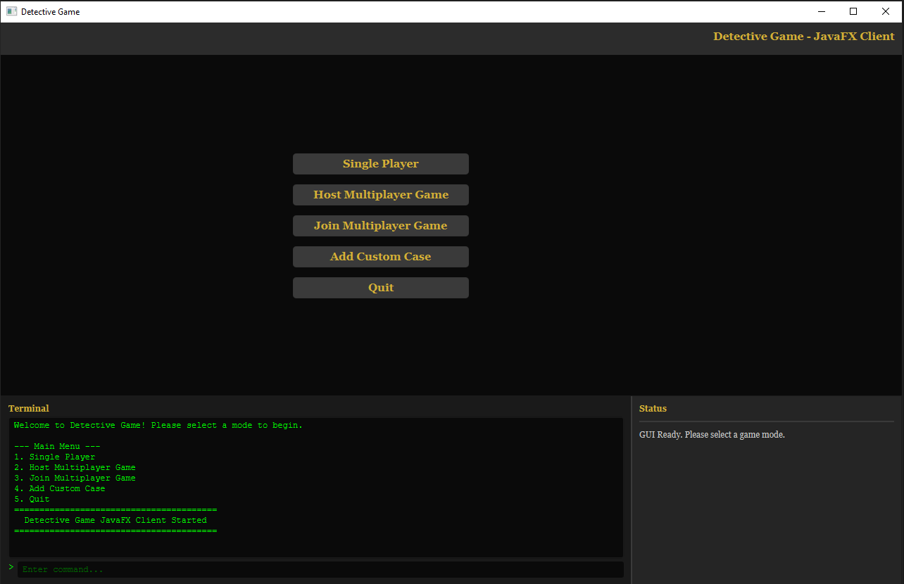
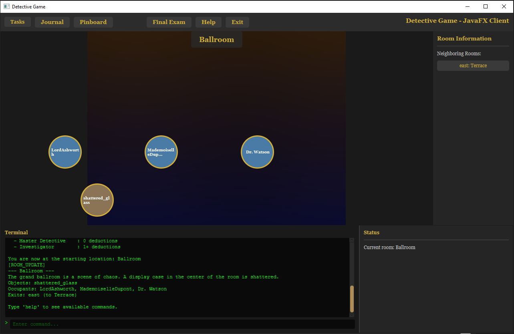
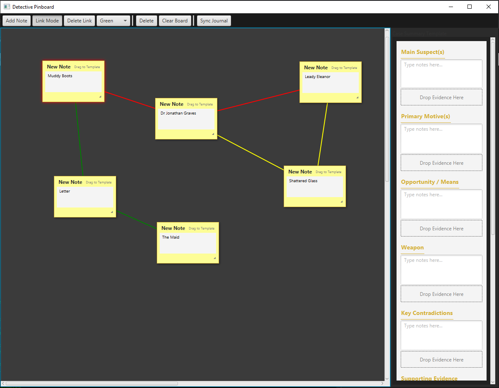
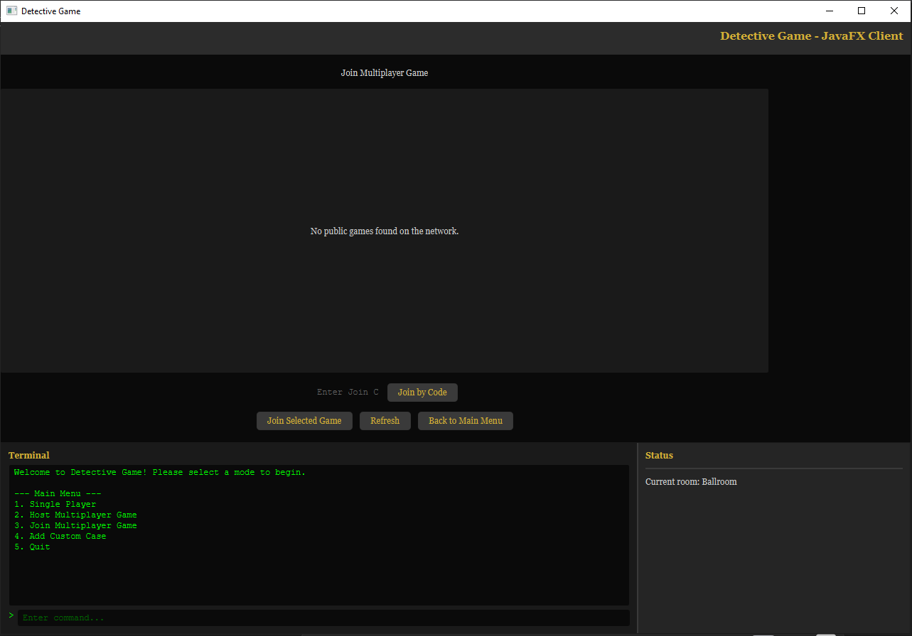

# **Sherlock’s Legacy – A Data-Driven Detective Game (Java, JavaFX, LAN Multiplayer)**

**Sherlock’s Legacy** is a fully data-driven detective investigation game built in Java, featuring:

* ✔ **JSON-defined cases** (rooms, suspects, objects, contradictions, tasks, final exam, images)
* ✔ **Hybrid Interface** – *JavaFX GUI + Embedded Terminal Console running simultaneously*
* ✔ **LAN Multiplayer** using **TCP (gameplay)** + **UDP (session discovery)**
* ✔ **State-driven suspects** (lie → truth → panic)
* ✔ **Contradiction & deduction system**
* ✔ **Final exam solving phase**
* ✔ **Extensible story engine** for user-created cases

This project originated as a laboratory assignment at ITMO University and evolved into a complete detective game framework.

---

## 📌 **Table of Contents**

* [Overview](#overview)
* [Features](#features)
* [Architecture](#architecture)
* [Multiplayer](#multiplayer)
* [JSON Case System](#json-case-system)
* [Interface](#interface)
* [Final Exam Mechanic](#final-exam-mechanic)
* [How to Create Your Own Detective Case](#how-to-create-your-own-detective-case)
* [Installation](#installation)
* [Running the Game](#running-the-game)
* [Project Structure](#project-structure)
* [Screenshots](#screenshots)
* [Contributors](#contributors)
* [License](#license)

---

# 📖 **Overview**

**Sherlock’s Legacy** is a narrative-driven detective puzzle game where all gameplay logic, locations, characters, and clues are generated from user-defined JSON files.
It supports **single-player** and **two-player LAN cooperative investigation**, allowing peers to work together in solving cases.

The engine is designed to be:

* **modular**, separating gameplay logic from interface and content
* **educational**, demonstrating clean architecture, data-driven design, and JavaFX integration
* **extensible**, enabling authors to create full detective stories without writing Java code

---

# ⭐ **Features**

### 🎮 **Gameplay**

* Explore rooms and discover clues
* Interrogate suspects with branching dialogue
* Detect contradictions using evidence
* Perform deductions unlockable through investigation
* Track your investigation using tasks and journal systems
* Solve a final structured exam to conclude the case

### 🖼️ **Visual & UI**

* Hybrid UI: **JavaFX GUI + always-visible terminal window**
* Optional **image support** (rooms, suspects, objects)
* Dynamic view updates and synchronized displays
* Pinboard-style mystery view

### 🌐 **LAN Multiplayer**

* TCP for reliable gameplay, synchronized actions, and asset transfer
* UDP broadcasting for automatic discovery of local games
* Case files and images are transferred from host to guest to prevent mismatches

### 🗂 **Data-Driven Structure**

* Fully JSON-based case descriptions
* Optional portrait and room image paths
* Easy to extend with new mechanics and content fields

---

# 🏛️ **Architecture**

Below is the simplified architecture structure:

```
 ┌────────────────────────┐
 │       CaseData         │  ← JSON: rooms, suspects, images, tasks, logic, exam
 └─────────────┬──────────┘
               │
 ┌─────────────▼─────────────┐
 │        GameContext         │  ← Runtime world state
 └─────────────┬─────────────┘
               │
 ┌─────────────▼─────────────┐
 │     CommandProcessor       │  ← Executes actions
 └─────────────┬─────────────┘
   updates     │     outputs
               ▼
   Entities / Tasks / Journal
```

Multiplayer relies on:

```
 TCP → Gameplay, synchronization, case.json, images
 UDP → LAN discovery (public games)
```

---

# 🌐 **Multiplayer**

Multiplayer is built on a hybrid networking system:

### **TCP (Main Communication)**

Used for:

* Commands
* State updates
* Chat
* Lobby coordination
* Case file transfer
* Image asset transfer

This ensures both players always have **the exact same case version**.

### **UDP (Discovery)**

Used only for finding public sessions:

* Host broadcasts availability
* Guests auto-detect games
* No need to manually type IPs

### **Session Flow**

1. Host creates a session
2. Guests see it in the list (UDP)
3. Guest connects via TCP
4. Host sends case.json + images
5. Investigation begins with synchronized state

---

# 🧩 **JSON Case System**

Cases are fully defined in a single `.json` file:

```json
{
  "metadata": { ... },
  "rooms": [
     { "name": "...", "image": "...", "neighbors": [...], "objects": [...] }
  ],
  "suspects": [
     { "name": "...", "image": "...", "statements": [...], "contradictions": [...] }
  ],
  "objects": [
     { "name": "...", "description": "...", "image": "...", "deduce": [...] }
  ],
  "tasks": [ ... ],
  "logic": { ... },
  "finalExam": [ ... ]
}
```

Optional “image” fields allow authors to add portraits and room illustrations.

If left blank → the GUI uses generic icons.

---

# 🖥️ **Interface**

Sherlock’s Legacy uses a **simultaneous hybrid UI**:

## **Embedded Terminal Console**

* Always visible
* Accepts full command input
* Mirrors all narrative text
* Useful for debugging & accessibility

## **JavaFX GUI**

* Buttons, lists, panels
* Interactive room views & images
* Suspect portraits
* Real-time journal & tasks
* Multiplayer lobbies

Both interfaces are **active at the same time**.
Players may:

* type a command in terminal
* click a GUI button afterward
* or mix both freely

Everything stays synchronized.

---

# 🧠 **Final Exam Mechanic**

The game ends with a structured **multiple-choice final exam**, defined in JSON.

### Key properties:

* Several questions requiring deduction
* Slot-based answers (e.g., *culprit*, *method*, *weapon*)
* Large answer space → prevents brute-forcing
* No attempt limits (trial-and-error is impractical due to combinatorics)
* Host and guest see synchronized results

This ensures that success requires *actual reasoning*, supported by all clues and contradictions discovered.

---

# 🧪 **Reliability & Testing**

Multiplayer and core mechanics were thoroughly tested:

* Session creation/destruction
* UDP discovery stability
* TCP synchronization
* Asset transfer (case.json + images)
* GUI/terminal hybrid behavior
* Error recovery (disconnects, stale sessions, failed joins)

---

# 🛠 **How to Create Your Own Detective Case**

1. Copy an existing JSON template from `/cases/`
2. Fill in:

   * rooms
   * suspects
   * objects
   * tasks
   * contradictions
   * final exam
3. (Optional) add image file paths
4. Place images in `/assets/...`
5. Load your case in the game

---

# 📦 **Installation**

### **Requirements**

* Java 17+
* JavaFX SDK
* Maven or Gradle (depending on your build)

### **Clone the Repository**

```sh
git clone https://github.com/USERNAME/SherlocksLegacy.git
cd SherlocksLegacy
```

### **Run With Maven**

```sh
mvn clean install
java -jar target/DetectiveGametest-1.0-SNAPSHOT.jar
```

---

# ▶️ **Running the Game**

### **Single Player**

Choose **Start Case → Select Case → Play**.

### **Host Multiplayer**

1. Open Multiplayer
2. Host new session
3. Case data is loaded
4. Guests join automatically via LAN discovery

### **Join Multiplayer**

1. Open Multiplayer
2. Select detected session
3. Game downloads the case + images from host
4. Begin cooperative investigation

---

# 🧱 **Project Structure**

```
src/
 ├── main/java/
 │    ├── engine/         ← Game logic, GameContext, CommandProcessor
 │    ├── net/            ← TCP + UDP networking
 │    ├── ui/
 │    │    ├── fx/        ← JavaFX GUI
 │    │    ├── terminal/  ← Embedded terminal console
 │    │    └── MainController.java
 │    ├── data/           ← JSON loaders, case parsers
 │    └── util/
 │
 ├── main/resources/
 │    ├── cases/          ← JSON case files
 │    ├── assets/         ← images (rooms, suspects, objects)
 │    └── ui/             ← FXML, CSS
```

---

# 🖼 **Screenshots**






---

# 👥 **Contributors**

### **Authors**

* **Amr Ibrahim Genidy Mohamed**
* **Hamza Yuksel**

### **Instructor & Guidance**

Special thanks to the supervising professor for:

* early debugging assistance
* architectural feedback
* spotting bad practices
* advising gameplay mechanics
* shaping the project’s design direction

---

# 📜 **License**

This project is distributed under the **MIT License**.
You are free to modify, distribute, and create your own detective cases.


Just let me know!
